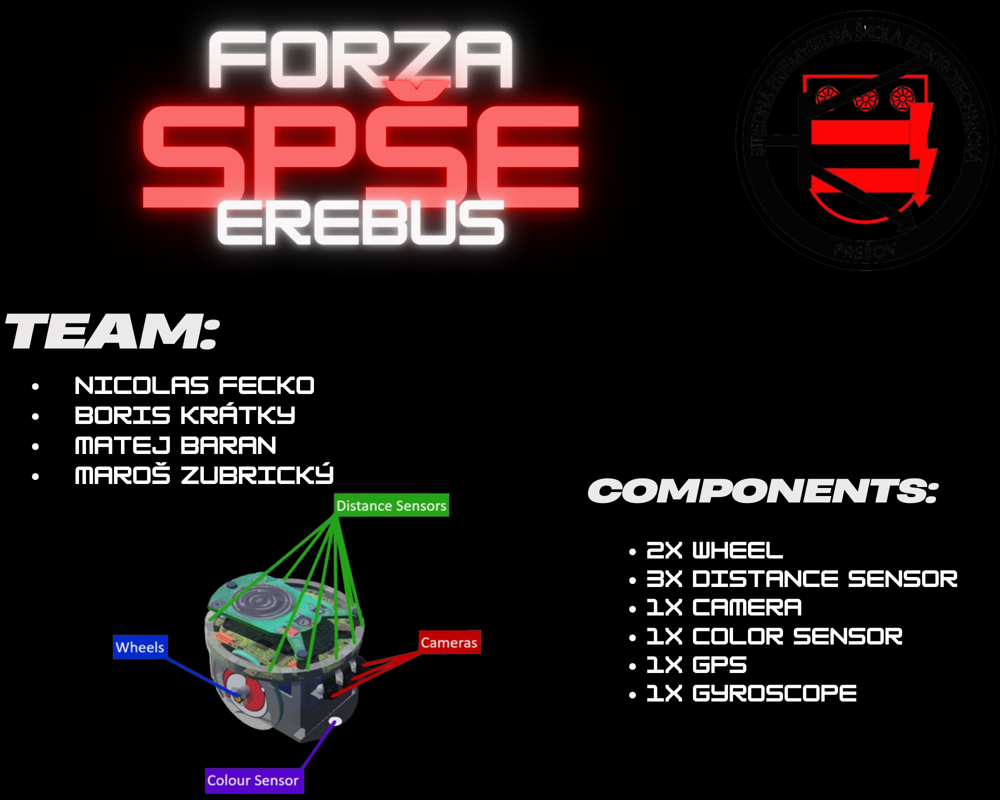

# 🤖 RoboCup Bratislava 2025

# 💫 About Us:
Sme študenti Strednej Priemyselnej školy elektrotechnickej.  
Súťažíme v kategórii Simulácie/Erebus

# Team:
- Nicolas Fecko
- Boris Kratky
- matej Baran
- Maroš Zubricky

# Použité Komponenty:
- 2x Wheel
- 3x Distance Sensor
- 1x Camera
- 1x Color Sensor
- 1x GPS
- 1x Gyroscope

# 💻 Použité jazyky:

# Poster:

